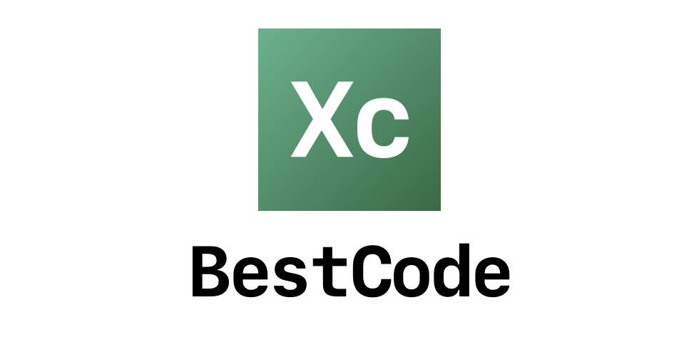
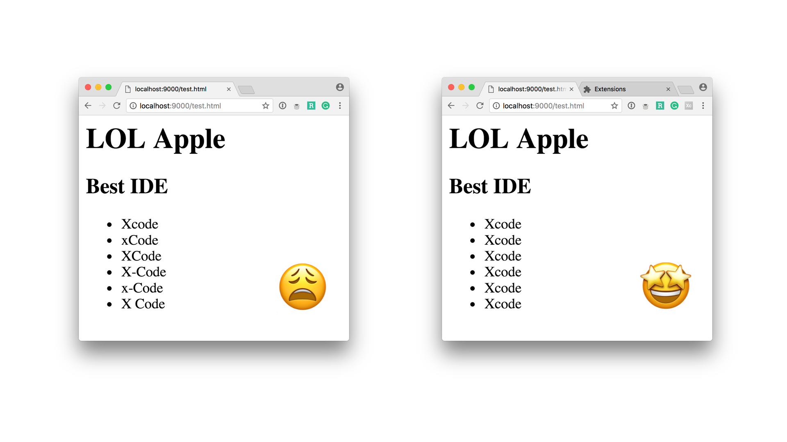

    

Welcome to **BestCode**, the browser extension that corrects every misspelling of the word "Xcode". 

Do you want to bang your head against a wall every time someone writes *XCode*? *xCode*? *X-code* maybe? Then this browser extension is made for you! You can install it on Safari, Chrome and Firefox, and avoid traumatic brain injuries (walls hurt).

## Before/After

    

## Installing

### Chrome

The extension is available on the Chrome Web Store.

[Get BestCode for Chrome](https://chrome.google.com/webstore/detail/bestcode/bhoejlhbicmildjaaimfbjcppllkpjla)

### Firefox

The extension is available on the Firefox add-on store.

[Get BestCode for Firefox](https://addons.mozilla.org/en-US/firefox/addon/bestcode)

### Safari

To install the extension on Safari, download the `BestCode.safariextz` file in the Releases section, and open the file. Safari will guide you through the installation process. 

[Download latest version](https://github.com/alexaubry/BestCode/releases)

## Contributing

If you find a bug or want to suggest an improvement to the extension, you contribution is very much appreciated! Please read the [Contributor's Guide](CONTRIBUTING.md) and the [Code of Conduct](CODE_OF_CONDUCT.md) before engaging with the project.

## Authors

This plugin was made by:

- [Alex Akers](https://github.com/a2) <[Twitter](https://twitter.com/a2)>
- [Alexis Aubry](https://github.com/alexaubry) <[Twitter](https://twitter.com/_alexaubry)>
- [Agis Tsaraboulidis](https://github.com/agisilaos) <[Twitter](https://twitter.com/agisilaosts)>

## License

*BestCode* is available under the MIT license. See the [LICENSE](LICENSE) file for more info.

However, we ask you not to re-publish the plugin under your own name on plugin stores. Thank you! 
